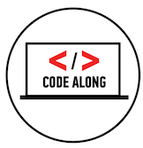

#BEWD: Back-end Web Development
## with Salman Ansari


---

##Course Overview

At a high level, we will focus on developing expertise with the following:

* The command line (terminal)
* Git and GitHub (source control)
* Ruby (programming language)
* Rails (web application framework)
* Developer tools & resources


<b>Most importantly, we will strive to teach you how to learn.</b>

---

## About Me: Salman Ansari
### Story: My favorite class.

---
##Once upon a time...
###I lived in a server room.


---
##Then one day...


---
##"I have created life"


---
##I helped build a company


---
##We got bought… by Oracle?


---
##Why are you telling us?
###Inspiration can strike anywhere.

---
## I'm an audiophile


---
## I'm a DJ


###soundcloud.com/daretorant

---
## I'm a writer (ranter)


###daretorant.com

---
##And now…
### The question you've all been waiting for.

---

##No, I'm not related to Aziz Ansari.


### Sorry.

---

## Meet Your Wonderful TA's

### Brooks Swinnerton
### Brian Fountain

---

##Course Administration

*	What you will get from us:
	* 	In-class labs
	* 	Homework
	* 	Class slides (viewable in GitHub)
	* 	Instructor & TAs!


*	What you need to submit to us:	
	*	At least 80% of all assigned homework
	*	A completed final project

---


##Lesson 1: Working Like a Developer
###Agenda

*	Setup
*	What is Web Development?
*	Command Line
*	Git & GitHub

---

##Setup
###Getting Your Dev Environment Ready


This class is using Ruby 2.0 (p195) and Rails 4.0 (RC1). 

If you haven't done so already, please take some time now to get your machine set up. 

View the installation guide here:

-	[tinyurl.com/bewd-install](http://tinyurl.com/bewd-install)

---


##Web Development
###The Web Application Stack


---

##Web Development
###Back-end vs Front-end Development

Let's define a few terms:

* _Web Development_ -> apps built for the web
* _Front-End Development_ -> client / browser code (HTML, CSS, JS)
* _Back-End Development_ -> server-side code (Ruby, C#.NET)

---


##Work Like a Developer
###Integrate into the developer community

* Choose the right OS, editors, & tools for your projects.
* Leverage the online community's vast libraries and documentation.
* Spread the knowledge you gain, and give back to the community when you can.
* Take pride & and joy in what you work on.
* Be efficient:
	* Use the keyboard as much as possible
	* If you find yourself doing the same thing repeatedly, automate it

---

##The Command Line
###What is it?

The command line is a terminal giving you direct access to your operating system. You can enter simple commands to perform a variety of functions.

Many of the tasks we need to carry out (such as committing our code) are best performed in the command line.

---

##The Command Line
###How do I start?

For Macs:

* Open the "Terminal" app
* For a better experience, download and install "iTerm 2", which is a replacement app that is slightly better.


For Windows:

* Open the "Command Prompt" application
* For a better experience, try "Console" (http://sourceforge.net/projects/console/)

---



##Command Line Basics (~20 min)

1. Make a script in bash to create a directory named code. 
2. Change into this folder
3. Create a file, complete, with the contents “Completed the exercise”
4. Change to your home directory
5. Show the contents of the completed file to the terminal
6. Make it executable
7. BONUS: Modify the script in some way to accept arguments.

[Answer](../code_alongs/coa_command_line_basics_code_along.sh)


---


##Command Line Exercise (~20 min)

-	Pair program.
-	Make a script in bash to create a directory named lists. 
-	Change into this folder
-	Create a file and use the first argument passed as the name.
-	Insert the contents of the second argument into the file
-	Show the contents of the completed file to the terminal

[Answer](../exercises/ex_command_line_basics_exercise.sh)

---

##Git
###What Is GIT?

* GIT is a source control management tool.
* GIT allows you to store and update your code in a structured way.
* GIT includes history of changes you make, so you can create "checkpoints" and track your work better over time.
* GIT allows multiple contributors to work on the same project, and has intelligence to resolve conflicts between changes committed by different people at different times.
* GIT is smart, but can be tricky.

---


##Git Basics (~30 min)

**_1. Adding git to a folder_**

-	Create a folder and change into it
-	Create 3 files config, log, runner.rb
-	Tell git to add this folder as a new repository
-	Tell git to track the 3 files in the repo


---


##Git Basics


**_2. Commiting_**

-	Open runner.rb in sublime text
-	Type ‘print “Commited!”’
-	Check the status of the file
-	Look at the difference in the file
-	Tell git it’s ok to commit this file
-	Commit the file
---


##Git Basics

**_3. Pushing Changes To GitHub_**

-	Log into Github
-	Create a new repository without a readme named first\_push
-	Go back to your folder and add the remote branch
-	PUSH your code to GitHub

[Answer](../code_alongs/coa_git_basics_code_along.sh)

---


##Git vs GitHub

*	<b>Git</b>: A tool used to manage <b>local</b> repositories
*	<b>GitHub</b>: A cloud-based platform used to manage <b>remote</b> repositories


---


##GitHub Forks
###Forks Explained


---


##Git In Class (~15 min)

-	Fork BEWDIful repository
-	Clone your copy of the repository
-	Set BEWDIful repository as a remote called instructor:
	-	```git remote add instructor git@github.com:sansari/BEWDiful_Students.git```
-	Pull updates from BEWDiful instructor
	-	```git fetch instructor``` then ```git merge instructor/master```
	- 	or just ```git pull instructor master``` (auto-merges)

[Answer](../code_alongs/coa_git_in_class.sh)

---


## Git It Together
-	Add a .txt file named blog and type your name and the URL to your blog
-	Commit your changes
-	Push them to your repository
-	Submit a pull request for your instructor to access those changes

[Answer](../exercises/ex_git_it_together.sh)

---


##Congrats!
###You're on your way.

You just took your first steps to becoming a developer. Keep it up.

* If you are still a bit lost, don't worry. Practice makes perfect. 
* Take a look at the cheat sheet in the resources folder under 01_Setup in your GA students GitHub repository (you should have this checked out locally now).
	* [http://tinyurl.com/bewd-cheat-sheet](http://tinyurl.com/bewd-cheat-sheet)

---

## Homework

-	Create a blog to document your experience
-	Write about your first BEWD class in your blog
